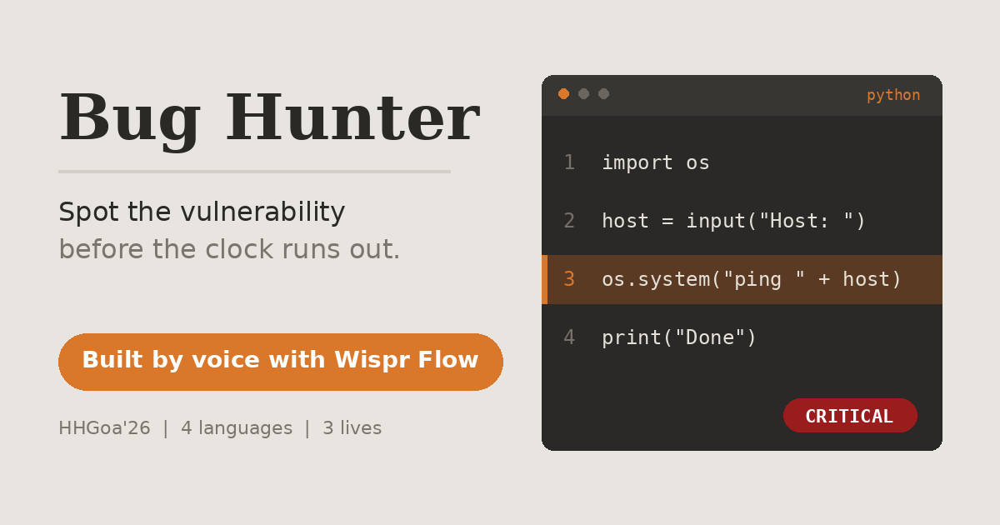

<div align="center">



# Bug Hunter

**A secure-coding game. Find the vulnerable line before the clock runs out.**


[Play it live](https://claude.ai/artifact/3cq1NVZ889KkX2Rwbz3UjW)

</div>

---

## About

Bug Hunter trains the habit every security reviewer needs: reading code and spotting the one line that is wrong. A short snippet appears in a dark, editor-style window with line numbers. You click the line you think is vulnerable, and the game tells you whether you were right, how severe the bug is, and how to fix it.

This project was built for the **HHGoa'26 Wispr Flow task**. I dictated the whole build with [Wispr Flow](https://wisprflow.ai) and generated the code with Claude.

## How to play

1. Press **Start hunt**.
2. Read the snippet and click the line that contains the vulnerability.
3. Answer fast: you have **30 seconds** per round, and the faster you click, the more bonus points you earn.
4. You start with **3 lives**. A wrong pick or a timeout costs one heart, and the game ends at zero.
5. Build a streak 🔥 by answering correctly in a row.
6. Finish all 10 rounds to see your score, accuracy and rank.

## Features

- 12 hand-written rounds in **JavaScript, Python, PHP and SQL**, with 10 chosen at random each game
- Per-round countdown with a draining progress bar
- Speed bonus scoring and a streak counter
- Three lives, with game over when they run out
- Severity badge (Critical, High, Medium) and a fix explanation after every answer
- Hacker-style typing animation on the start screen
- Result screen with score, accuracy, best streak and a rank title
- Confetti for high scores
- Smooth transitions between rounds
- Responsive layout for phones, with large tap targets
- Keyboard accessible (Tab to a line, Enter or Space to pick it) and respects reduced-motion settings

## Vulnerabilities covered

| Class | Severity | Languages |
|---|---|---|
| SQL injection | Critical | JavaScript, Python, SQL |
| Command injection | Critical | Python, PHP |
| Missing authentication | Critical | JavaScript |
| Cross-site scripting (XSS) | High | JavaScript, PHP |
| Hard-coded passwords | High | Python, PHP |
| Weak hashing (MD5) | Medium | Python, JavaScript |

## Scoring and ranks

Each correct answer is worth **100 points plus up to 100 speed-bonus points**, scaled by how much of the 30 seconds was left when you clicked.

| Accuracy | Rank |
|---|---|
| 90% and above | Elite pen tester |
| 60% to 89% | Bug hunter |
| Below 60% | Script kiddie |

Accuracy is calculated over the rounds you actually played. Confetti fires at 80% accuracy or higher.

## Run it locally

There is nothing to install or build. It is one self-contained HTML file.

```bash
git clone https://github.com/MishitaDodani/Bug-Hunter.git
cd Bug-Hunter
open bug-hunter.html      # macOS
# xdg-open bug-hunter.html   # Linux
# start bug-hunter.html      # Windows
```

To host it on **GitHub Pages**, rename `bug-hunter.html` to `index.html`, then enable Pages for the repository in Settings.

## Add your own rounds

Rounds live in the `ROUNDS` array near the top of the script. Each one is a plain object:

```js
{
  lang: "Python",
  file: "ping.py",
  type: "Command injection",   // must match a key in the SEV table
  bug: 2,                      // zero-based index of the vulnerable line
  lines: [
    `import os`,
    `host = input("Host to ping: ")`,
    `os.system("ping -c 1 " + host)`,
    `print("Done")`
  ],
  why: "The shell sees whatever the user typed. Use subprocess.run with a list of arguments instead."
}
```

Snippet lines are rendered with `textContent`, so even deliberately malicious-looking code like XSS payloads is displayed as text and never executed.

## Tech

Vanilla HTML, CSS and JavaScript in a single file. No frameworks, no build step, no network requests.

## Disclaimer

The code snippets are intentionally vulnerable and exist only for education. Do not copy them into real projects.

## Author

**Mishita Dodani**, MCA student specializing in cybersecurity.

- LinkedIn: [mishita-dodani-381664253](https://www.linkedin.com/in/mishita-dodani-381664253/)
- GitHub: [MishitaDodani](https://github.com/MishitaDodani)

## Acknowledgements

- [Wispr Flow](https://wisprflow.ai) and HHGoa'26 for the build challenge
- Claude for generating the code from voice-dictated prompts
- The [OWASP Top 10](https://owasp.org/www-project-top-ten/) for the vulnerability classes
